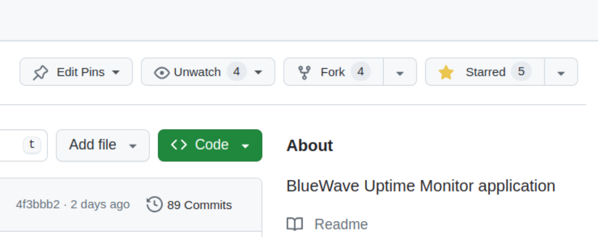

# Git Collaborative Workflow Tutorial

## Forking a Repository

1.  Go to the Github page for the repository in question

2.  Click on "Fork" in the top right corner
    

## Creating and Checking out a Branch

## Adding and Committing Changes

## Pushing Your Branch

## Making a Pull Request
