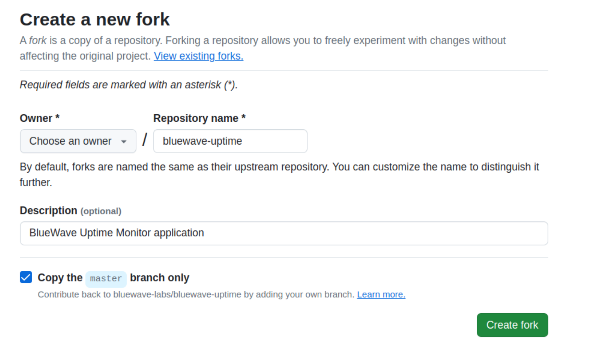

# Git Collaborative Workflow Tutorial

## Forking a Repository

> 1.  Go to the Github page for the repository in question
>
> 2.  Click on "Fork" in the top right corner
>     
>
> 3.  Set the owner of the fork to yourself and click "Create fork"
>     

---

## Clone the forked repository

> Clone the forked repository to your machine by running
>
> `git clone <repository_address>`
>
> Example:
>
> `git clone git@github.com:my_name/bluewave_collaborative_git.git`

---

## Set up the original repository as a remote

> You will want to be able to push and pull from the original repository. To do so, run:
>
> `git remote add <remote_name> <original_repository_address>`
>
> Example:
>
> ```
> git remote add upstream git@github.com:popnfresh234 bluewave_collaborative_git.git
> ```

---

## Fetching changes from upstream and merging

> You will often want to start from the latest code from the original prroject. To do so, run
>
> `git fetch <oringal_repository_remote>`
>
> Example:
>
> `git fetch upstream`
>
> Then, checkout the branch in **your forked repository** that you want to merge into, often master:
>
> `git checkout <branch_name>`
>
> Example:
>
> `git checkout master`
>
> Finally, merge the branch from the remote repository into your branch:
>
> `git merge <remote> <branch_name>`
>
> Example:
>
> `git merge upstream master`
>
> This will merge the remote master branch from the original repository into your forked repository's master branch
>
> Your code on your forked repository's master is now up to date with master of the original repository. This is a great place to create a new branch and start on a new feature.

---

## Creating and Checking out a Branch

It's a good idea to create a branch for features on your project.

### Creating a Branch

> Create a branch by running:
>
> `git branch <branch_name`
>
> Example:
>
> `git branch feat/my-feature`
>
> Your team will have their own naming conventions, but I like to use:
>
> Feature:
>
> `feat/<descriptive_feature_name`
>
> Fixes:
>
> `fix/<descriptive_fix_name`
>
> Whatever convention you choose, try to make the names descriptive

### Checking Out a Branch

> To switch to a branch and work on it, run
>
> `git checkout <branch_name>`
>
> Example:
>
> `git checkout feat/my-feature>`
>
> You are now ready to start working on your feature

_Hint_

> Creating and checking out a branch can be combined in one command:
>
> `git checkout -b <branch_name>`
>
> Example:
>
> `git checkout -b feat/my_feature`

---

## Adding and Committing Changes

### Adding to Git

> Now that you've made some changes, you will want to add them to git. To do so, you have some options.
>
> To add all of your changes in your projet to git, run:
>
> `git add .`
>
> To add a specific file to git, run:
>
> `git add <filename>`
>
> ### Committing to Git
>
> Now that you've added your changes, it's time to commit:
>
> `git commit -m "<descriptive_change_message>"`
>
> Example:
>
> `git commit -m "Added my name to Readme file"`

---

## Pushing Your Branch

> You've commited your code, now it's time to share it. To do so, we can push our branch to a repository. You will likely want to push your branch to the original repository so it can be merged in. You can do so by running:
>
> `git push <orignal_repository_remote> <branch_name>`
>
> Example:
>
> `git push upstream feat/my-feature`
>
> You can also push to you rown repository:
>
> `git push feat/my-feature`
>
> This is useful if your branch isn't ready to merge into the original repository yet, or if you want to merge it into your own codebase.

## Making a Pull Request

Finally, it's time to get our feature branch merged into the codebase.

Head over to Github and go to the original repository. You should see that your branch has made it there!
